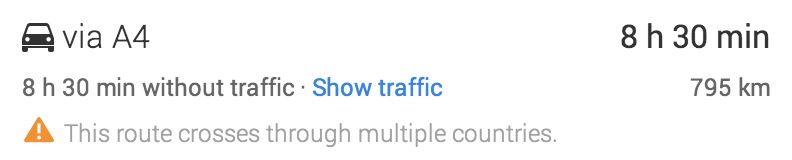

+++
title = "Europe Day 14: First Visit to Luxembourg"
date = 2014-09-20T21:00:56+02:00
updated = 2025-12-31T18:47:45+09:00

[taxonomies]
country = ["France", "Luxembourg"]

[extra]
distance = "795 km / 494 mi"
route = "Cologne, Germany, to Dornbirn, Austria"
markers = "markers.js"
track_log_key = "kml/v1/2014/09/2014-09-20.kml"
bounds = {sw = [47.407, 6.102], ne = [50.957, 9.708]}
cover = "es-2689-003"
cover_cdn_key = "img/v1/2014/09/es-2689-003"
+++

I added Luxembourg to my [list of countries visited](/countries/) and found it absolutely charming.

<!-- more -->

I'll add one more tomorrow morning.

I wish I had given myself a bit more time for the drive through Switzerland. Darkness hit about the time I drove around Zürich.

{{ es_cdn_image(id = "es-2689-003", cdn_version = "v1", cdn_key = "img/v1/2014/09/es-2689-003", caption = "Beidweiler, Luxembourg") }}

{{ es_cdn_image(id = "es-2688-016", cdn_version = "v1", cdn_key = "img/v1/2014/09/es-2688-016", title = "Across the Sea", caption = "Crastatt, Alsace, France") }}

{{ es_cdn_image(id = "es-2689-007", cdn_version = "v1", cdn_key = "img/v1/2014/09/es-2689-007", caption = "Crastatt, Alsace, France") }}

When I was planning today's route last night, Google gave me this warning:

My dear Google, that's the flipping point! Haven't you learned that about me yet?

(The more appropriate warning might have been, "That's a long distance to drive in one day.")
