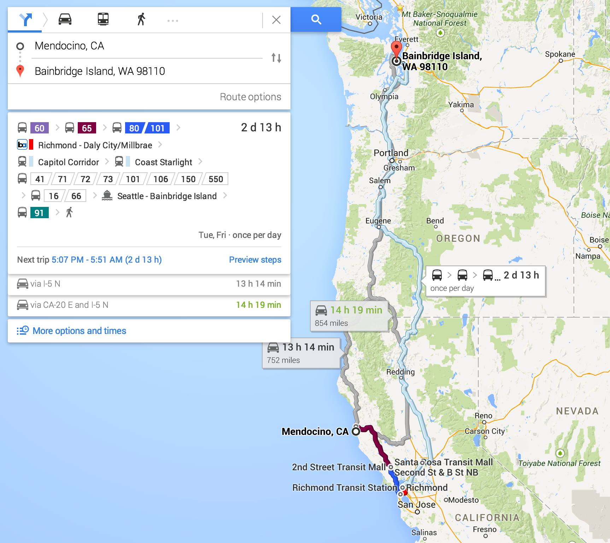

+++
title = "Western US Roadtrip Day 12: Mendocino Walkabout"
date = 2014-11-20T15:58:50-08:00
updated = 2026-01-27T22:00:14-08:00

[taxonomies]
state = ["California"]

[extra]
distance = "4.7 km / 2.9 mi"
route = "around Mendocino, California"
markers = "markers.js"
track_log_key = "kml/v1/2014/11/2014-11-20.kml"
bounds = {sw = [39.298, -123.814], ne = [39.318, -123.794]}
cover = "es-2735-007"
cover_cdn_key = "img/v1/2014/11/es-2735-007"
+++

Today was a mellow day in one of my favorite places. I walked around town and the parks along the shore. And that was it.

<!-- more -->

{{ es_cdn_image(id = "es-2732-003", cdn_version = "v1", cdn_key = "img/v1/2014/11/es-2732-003", caption = "Mendocino, California") }}

{{ es_cdn_image(id = "es-2733-017", cdn_version = "v1", cdn_key = "img/v1/2014/11/es-2733-017", caption = "Mendocino, California") }}

{{ es_cdn_image(id = "es-2735-007", cdn_version = "v1", cdn_key = "img/v1/2014/11/es-2735-007", caption = "Mendocino, California") }}

This. This is why I came here. I needed some of this.

{{ es_cdn_video(id = "es-2735-012", cdn_version = "v1", cdn_key = "vid/v1/2014/11/es-2735-012", caption = "Mendocino, California") }}

{{ es_cdn_image(id = "es-2735-013", cdn_version = "v1", cdn_key = "img/v1/2014/11/es-2735-013", caption = "Mendocino, California") }}

Ahhhh ...

{{ es_cdn_image(id = "es-2735-015", cdn_version = "v1", cdn_key = "img/v1/2014/11/es-2735-015", caption = "Mendocino, California") }}

{{ es_cdn_image(id = "es-2734-014", cdn_version = "v1", cdn_key = "img/v1/2014/11/es-2734-014", caption = "Mendocino, California") }}

This afternoon, I asked Google Maps for directions home from where I am Mendocino. I am impressed / amused / stunned that it managed to come up with a public transit option. Mind you, it takes almost three days and involves ten different bus, train, and ferry routes, but ... it _could_ be done!

